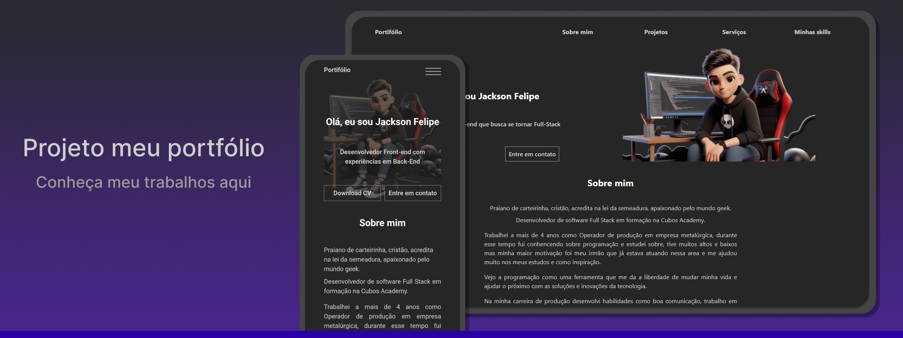

<h1 align="center"> Portifólio </h1>

Essa página foi desenvolvida para você pode saber um pouco mais sobre mim seja, minhas habilidades,motivação ou serviços.  
<a href="https://portifolio-jackson.vercel.app/">Confira clicando aqui.</a>

  <a href="#-tecnologias">Tecnologias</a>&nbsp;&nbsp;&nbsp;|&nbsp;&nbsp;&nbsp;
  <a href="#-projeto">Projeto</a>&nbsp;&nbsp;&nbsp;|&nbsp;&nbsp;&nbsp;
  <a href="#-layout">Layout</a>&nbsp;&nbsp;&nbsp;|&nbsp;&nbsp;&nbsp;
  <a href="#memo-licença">Licença</a>

  

 

  

## 🚀 Tecnologias

Esse projeto foi desenvolvido com as seguintes tecnologias:

- HTML5 e CSS3 
- FrameWorks (React, Vite e Tailwind)
- Git e Github

## 💻 Projeto

Fiz o portifólio para me posicionar como um programador e aumentar a visibilidade e meu alcance focando em adquirir uma oportunidade para trabalhar como desenvolvedor.

- [Acesse o projeto finalizado, online](https://portifolio-jackson.vercel.app//)

## 🔖 Layout

O layout foi baseado no portifólio de  [Jamile Cruz](https://portfolio-jamile.vercel.app//) 

## :memo: Licença

Esse projeto está sob a licença MIT.

---
